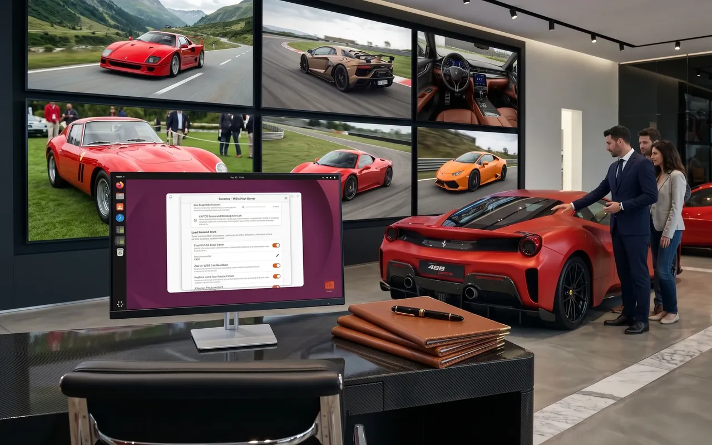
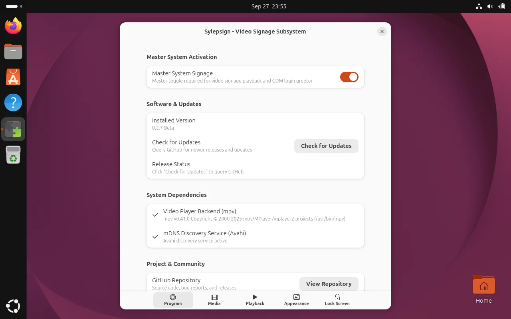
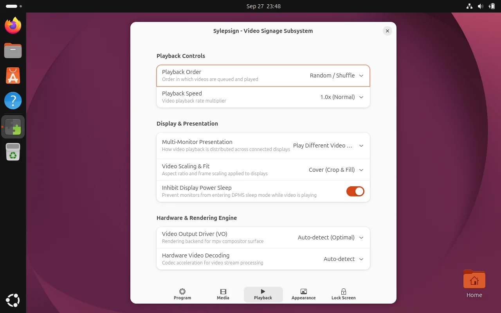
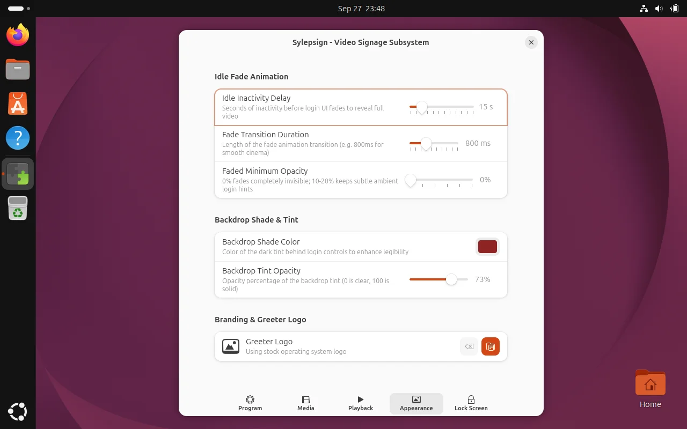
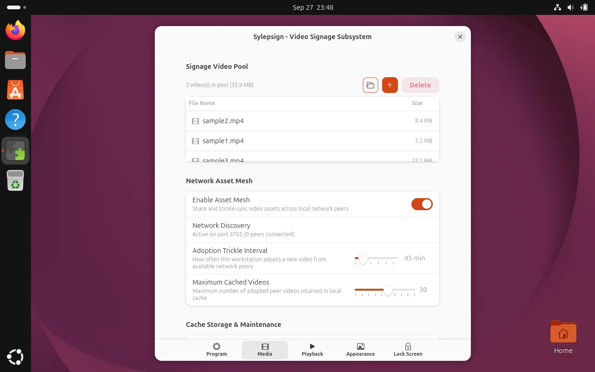
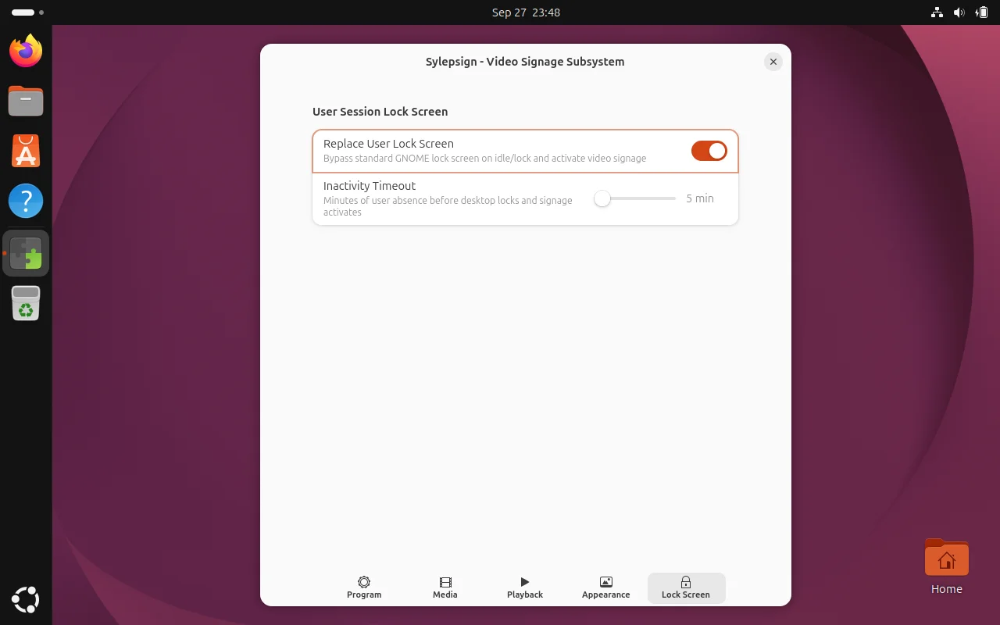

# Sylepsign

A hardware-accelerated video signage subsystem, idle monitor, and peer-to-peer asset distribution mesh for GNOME Shell and the GDM greeter.



---

## Overview

Sylepsign transforms Linux workstations, digital kiosks, and GNOME desktop fleets into dynamic video signage displays whenever machines sit idle or remain at the GDM (GNOME Display Manager) login screen.

Operating natively within GNOME Shell under Wayland, Sylepsign displays hardware-accelerated video beneath the GDM greeter and lock screen. System authentication boundaries remain completely secure while delivering smooth, cinematic visual backdrops across single or multi-monitor setups.

---

## Features

* **GDM Greeter & Lock Screen Signage**: Plays video beneath GDM login prompts. Greeter dialogs and shell chrome smoothly fade out during inactivity, revealing uninterrupted full-screen video that instantly returns on keyboard, mouse, or touch input.
* **Hardware-Accelerated Playback**: Uses an optimized `mpv` engine with direct GPU acceleration (VA-API, NVDEC, dmabuf-wayland) for smooth 4K and 1080p playback with minimal CPU usage.
* **Multi-Monitor Display**: Mirror playback across all attached monitors or queue distinct videos independently on each screen.
* **Display Sleep Inhibition**: Prevents DPMS screen blanking while video signage is active so displays remain illuminated.
* **Decentralized Peer-to-Peer Mesh**: Discovers local signage nodes via Avahi mDNS and synchronizes media pools over the local network without requiring a centralized server.
* **Libadwaita Preferences**: A modern GNOME settings interface to configure playback, visuals, media pools, and greeter branding.
* **CLI Management Tool**: Inspect service health, manage video assets, set custom greeter logos, and trigger updates from the terminal.

---

## Installation

Sylepsign supports GNOME Shell 46 through 51 on Ubuntu, Debian, Fedora, Arch Linux, and openSUSE.

### One-Line Install

Run the automated installer with `curl` or `wget`:

```bash
curl -fsSL https://raw.githubusercontent.com/alecdromano/sylepsign/main/install.sh | sudo bash
```

Or using `wget`:

```bash
wget -qO- https://raw.githubusercontent.com/alecdromano/sylepsign/main/install.sh | sudo bash
```

Alternatively, clone the repository and run the installer:

```bash
git clone https://github.com/alecdromano/sylepsign.git
cd sylepsign
sudo ./install.sh
```

---

## Adding Videos

Videos are indexed from the system signage pool at `/var/lib/signage-pool/`.

Place video files (`.mp4`, `.webm`, `.mkv`) into the pool directory:

```bash
sudo cp /path/to/video.mp4 /var/lib/signage-pool/
```

Sylepsign indexes new videos automatically. You can view all indexed local and cached peer videos at any time:

```bash
sylepsign videos
```

---

## Settings & Configuration

Configure Sylepsign using the **Extensions** app or directly from the terminal:

```bash
gnome-extensions prefs sylepsign@alecromano.com
```

### Program & System Status

Inspect background daemon status, verify hardware dependencies (`mpv`, `avahi`), and check for updates.



> **Note:** Settings that affect user sessions take effect immediately. Changes affecting the system-wide GDM greeter stage a notification banner and prompt for authentication via PolicyKit when applied.

### Playback

Configure video fit (crop & fill, preserve aspect ratio, or stretch), multi-monitor presentation, playback order (shuffle or sequential), speed multipliers, and GPU hardware decoding.



### Appearance & Greeter Branding

Customize the idle inactivity timeout, fade transition speed, backdrop legibility tint and opacity, or replace the stock GDM greeter logo with your own branding image.



### Media Pool & Peer Mesh

Manage local video assets directly in the UI, or enable local network discovery and peer asset synchronization to automatically adopt videos across nearby workstations.



### Lock Screen

Toggle user session lock screen replacement and set idle timeout thresholds for seamless signage takeover.



---

## Command-Line Interface

The `sylepsign` CLI tool provides convenient system and asset management:

```bash
sylepsign status          # Show daemon health, pool item count, and connected peers
sylepsign videos          # List all indexed local and cached peer videos
sylepsign logo /path.png  # Deploy a custom logo to the GDM login greeter
sylepsign logo --reset    # Restore the default operating system greeter logo
sylepsign enable          # Enable background service, GDM greeter, and session extension
sylepsign disable         # Disable background service, GDM greeter, and session extension
sylepsign uncache         # Clear peer-replicated cache assets
sylepsign restart         # Restart the background signage service
sylepsign update          # Check for software updates
sylepsign upgrade         # Download and install the latest release
sylepsign uninstall       # Completely remove Sylepsign from the system
```

---

## Upgrades & Removal

### Updating Sylepsign

To check for and install updates:

```bash
sylepsign update
sylepsign upgrade
```

Or update from a local git clone:

```bash
sudo ./install.sh --update
```

### Uninstallation

To completely remove Sylepsign, stop active playback processes, unload GNOME Shell extensions, and clean system dconf profiles and media pools:

```bash
sylepsign uninstall
```
